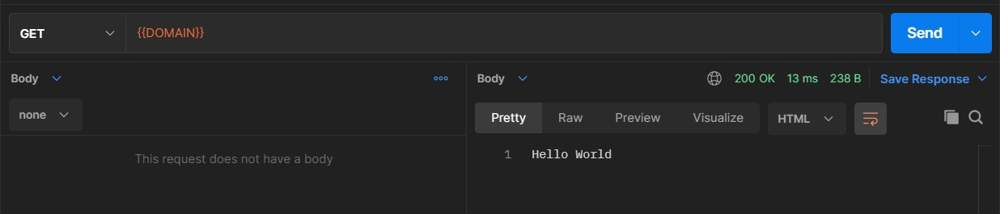

## Initialization:

---

```bash
npm/yarn init -y
```

## Dependencies:

---

```bash
yarn add express dotenv mongoose
yarn add nodemon --dev
```

## Configure package.json:

---

```json
{
   "type": "module",
   "scripts": {
      "start": "node src/server.js",
      "dev": "nodemon src/server.js"
   }
}
```

```ts
import dotenv from 'dotenv';
dotenv.config();
```

## Mongodb Installations using `winget`:

---

```cmd
winget install MongoDB.Server
winget install MongoDB.Compass.Full
winget install Postman.Postman
```

`path: C:\Program Files\MongoDB\Server\4.4\bin`

## Postman configuration:

---

\
\

