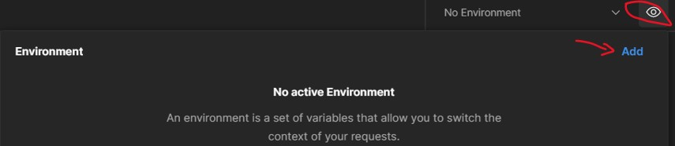
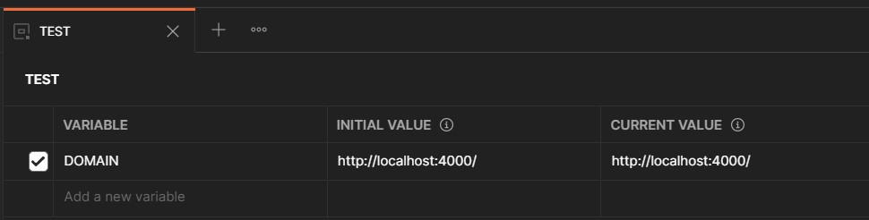

# Overview

-  initialization
-  dependencies
-  package.json
-  postman
-  db
   -  mongodb
   -  faker.js
   -  [seeding](#seed)

## Initialization:

```bash
npm/yarn init -y
```

## Dependencies:

```bash
yarn add express dotenv mongoose pino pino-pretty dayjs
yarn add nodemon --dev
```

```ts
import dotenv from 'dotenv';
dotenv.config();
```

## Configure package.json:

```json
{
   "type": "module",
   "scripts": {
      "start": "node src/server.js",
      "dev": "nodemon src/server.js",
      "seed": "cd src/db && node --experimental-json-modules seeder",
      "faker": "cd src/db && node faker"
   }
}
```

## Postman configuration:

> Postman Installation:

```
winget install Postman.Postman
```

> Environment Setup:

 

## Mongodb Installations using `winget`:

### Installations:

```cmd
winget install MongoDB.Server
winget install MongoDB.Compass.Full
```

`Add path to env: C:\Program Files\MongoDB\Server\4.4\bin`

## Faker.js

[Github](https://github.com/marak/Faker.js/)\
[UnOfficial Doc](https://fakerjsdocs.netlify.app/)\
[Demo](https://rawgit.com/Marak/faker.js/master/examples/browser/index.html)

> Note: `random` deprecated, instead use `datatype`

**Generating data:**

```
yarn faker [file_name]! [no. of items]!
```

EX:

```
yarn faker
yarn faker user.json
yarn faker product.json 100
```

<div id="seed"/>

## Seeding Data:

Importing data:

```
yarn seed -i
```

Deleting data:

```
yarn seed -d
```
