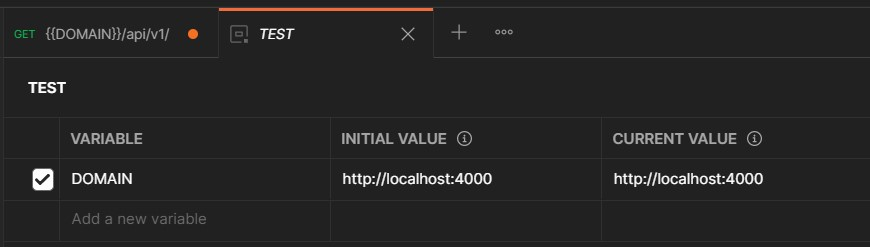

# Overview

- initialization
- dependencies
- package.json
- postman
- db
  - [mongodb](#mongodb)
  - [faker.js](#faker)
  - [seeding](#seed)
- [Error Handler](#error-handling-in-expressjs)
  - [Error Handling Middleware](#error-handling-middleware)
  - [Catching Async Errors](#catching-async-errors)
  - [Handle Unhandled Promise Rejection](#handle-unhandled-promise-rejection)
  - [Handling Uncaught Exceptions](#handling-uncaught-exceptions)
## Initialization

```bash
npm/yarn init -y
```

## Dependencies

```bash
yarn add express dotenv mongoose pino pino-pretty dayjs
yarn add nodemon --dev
```

```ts
import dotenv from 'dotenv';
dotenv.config();
```

## Configure package.json

```json
{
   "type": "module",
   "scripts": {
      "start": "node src/server.js",
      "dev": "nodemon src/server.js",
      "seed": "cd src/db && node --experimental-json-modules seeder",
      "faker": "cd src/db && node faker"
   }
}
```

## Postman configuration

> Postman Installation:

```
winget install Postman.Postman
```

> Environment Setup:

 


# Mongodb

## Mongodb Installations using `winget`

### Installations

```cmd
winget install MongoDB.Server
winget install MongoDB.Compass.Full
```

`Add path to env: C:\Program Files\MongoDB\Server\4.4\bin`

<div id="seed"/>

## Seeding Data

Importing data:

```bash
yarn seed -i
```

Deleting data:

```bash
yarn seed -d
```

<div id="faker" ></div>

## Faker.js

[Github](https://github.com/marak/Faker.js/)\
[UnOfficial Doc](https://fakerjsdocs.netlify.app/)\
[Demo](https://rawgit.com/Marak/faker.js/master/examples/browser/index.html)

> Note: `random.number()` deprecated, instead use `datatype.number()`

**Generating data:**

```bash
yarn faker [file_name]! [no. of items]!
```

EX:

```bash
yarn faker
yarn faker user.json
yarn faker product.json 100
```

> random Id From Given Ids:

```js
import faker from 'faker';
let arr = [
   '60c8e5977008b5518069f811',
   '60c8e5977008b5518069f812',
   '60c8e5977008b5518069f813',
   '60c8e5977008b5518069f814',
   '60c8e5977008b5518069f815'
];

let uid = faker.random.arrayElement(arr);

```

> random But Unique Id From Given Ids:

```js
import faker from 'faker';
let arr = [
   '60c8e5977008b5518069f811',
   '60c8e5977008b5518069f812',
   '60c8e5977008b5518069f813',
   '60c8e5977008b5518069f814',
   '60c8e5977008b5518069f815'
];
let _ = {
   unique_id: 0,
   random_unique_UUIDFromGiven: function (arr, count) {
      if (this.unique_id === arr.length) {
         log.error(`Array Out of Bound; Max Allowed ${this.unique_id} items`);
         // as we cant generate more unique id;
         process.exit();
      }
      let uuid = arr[this.unique_id++];
      return uuid;
   }
};
```

> generate Array of Object Id:

```js
//Generate Object id
let GeneratedObjectIDs = [];
for (let i = 0; i < N; i++) {
   let id = ObjectID();
   ObjectIDs.push(id);
}
```

> Ex: Products

```javascript
let data = [...Array(N)].map(() => ({
      name: faker.commerce.productName(),
      price: faker.commerce.price(10, 1000000),
      description: faker.lorem.sentences(4),
      rating: faker.datatype.number(5),
      images: [...Array(getRandom(5))].map(() => ({
         url: faker.image.food(),
         public_id: faker.datatype.uuid()
      })),
      category: faker.random.arrayElement([
         'Electronics',
         'Cameras',
         'Laptop',
         'Accessories',
         'Headphones',
         'Food',
         'Books',
         'Clothes/Shoes',
         'Beauty/Health',
         'Sports',
         'Outdoor',
         'Home'
      ]),
      seller: faker.company.companyName(),
      stock: faker.datatype.number(5),
      reviews: [...Array(getRandom(4))].map(() => ({
         name: faker.name.findName(),
         rating: faker.datatype.number(5),
         comment: faker.lorem.sentences()
      }))
   }));
```

.

# Error Handling In Express.js

## Error Handling Middleware


```javascript
const getSingleProduct = async (req, res, next) => {
   const product = await Product.findById(req.params.id);
   // Pass to Error Middleware....
   if (!product) return next(new ErrorHandler('Product Not Found'));

   //...
};
```

`utils/errorHandler.js`

```javascript
// Custom Error Handler Class
class ErrorHandler extends Error {
   constructor(message, statusCode) {
      super(message);
      this.statusCode = statusCode;
      Error.captureStackTrace(this, this.constructor);
   }
}
export default ErrorHandler;
```

`middleware/error.js`

```javascript
import { environment } from '../config.js';
export default function errors(err, req, res, next) {
   err.statusCode = err.statusCode || 500;
   if (environment === 'DEVELOPMENT') {
      res.status(err.statusCode).json({
         success: false,
         error: err,
         message: err.message,
         stack: err.stack
      });
   }

   if (environment === 'PRODUCTION') {
      let error = { ...err };
      error.message = err.message;
      res.status(error.statusCode).json({
         success: false,
         message: error.message || 'Internal Server Error'
      });
   }
}
```

`app.js`

```javascript
import errorHandlerMiddleware from './middlewares/errors.js';
//...

app.use('/api/v1', productRouter);

// Error Middleware
app.use(errorHandlerMiddleware);
```

## Catching Async Errors

**What Happens if any Validation fails ??**

e.g. not providing any `required` felids in POST request

Without Try Catch Blocks:

```javascript
const newProduct = async (req, res) => {
   const product = await Product.create(req.body);
   res.json({
      success: true,
      data: product
   });
};
```


_(node:17644) UnhandledPromiseRejectionWarning: Unhandled promise rejection. This error originated either by throwing inside of an async function without a catch block, or by rejecting a promise which was not handled with .catch()._

With Try Catch Blocks:

```javascript
const newProduct = async (req, res) => {
   try {
      const product = await Product.create(req.body);
      res.json({
         success: true,
         data: product
      });
   } catch (e) {
      res.json(e);
   }
};
```


**Using Try Catch for every Controller is Cumbersome**

### Avoiding try catch:

`middlewares/catchAsyncError.js`

```javascript
export default function catchAsyncErrors(fun) {
   // takes a async function
   return async (req, res, next) => {
      try {
         await fun(req, res, next); //call that function
      } catch (e) {
         next(e); //pass error to middleware
      }
   };
   //Or, using resolve
   //    return (req, res, next) => {
   //       Promise.resolve(fun(req, res, next)).catch(next);
   //    };
}
```

Other packages that can be used: [express-async-handler](https://www.npmjs.com/package/express-async-handler)

**Now in Controllers, we don't need to use Try Catch Every time:**

```javascript
import catchAsyncError from '../middlewares/catchAsyncErrors.js';

const newProduct = catchAsyncError(async (req, res) => {
   const product = await Product.create(req.body);
   res.json({
      success: true,
      data: product
   });
});

const getAllProduct = catchAsyncError(async (req, res) => {
   const products = await Product.find();
   res.json({
      success: true,
      count: products.length,
      data: products
   });
});
const getSingleProduct = catchAsyncError(async (req, res, next) => {
   const product = await Product.findById(req.params.id);
   if (!product) return next(new ErrorHandler('Product Not Found'));
   //...
});

const updateProduct = catchAsyncError(async (req, res) => {
   let product = await Product.findById(req.params.id);
   if (!product) return next(new ErrorHandler('Product Not Found'));

   product = await Product.findByIdAndUpdate(req.params.id, req.body, {
      new: true,
      runValidators: true,
      useFindAndModify: false
   });
   //...
});

const deleteProduct = catchAsyncError(async (req, res) => {
   const product = await Product.findById(req.params.id);
   if (!product) return next(new ErrorHandler('Product Not Found'));

   await product.remove();
   ///...
});


```

## Handle Unhandled Promise Rejection

For example, invalid mongoose connection string throws: _`(node:13652) UnhandledPromiseRejectionWarning: MongoParseError: Invalid connection string`_

Handling this types of error:

`app.js`


```javascript
// Handle Unhandled Promise Rejection e.g  MongoParseError: Invalid connection string
const server = app.listen(port, () => {
   log.info(
      `Server listening at http://localhost:${port} in ${environment} mode`
   );
});

process.on('unhandledRejection', (e) => {
   log.error(e.message);
   log.warn('Shutting down the server due to Unhandled Promise rejection');
   server.close(() => {
      process.exit(1);
   });
});
```

We can also handle Mongoose errors explicitly:

`db.js`


```javascript
export const connectDB = () => {
   mongoose
      .connect(db_uri, {
         useNewUrlParser: true,
         useUnifiedTopology: true,
         useCreateIndex: true,
         useFindAndModify: false
      })
      .then((con) => {
         log.info(`DB connected with HOST: ${con.connection.host}`);
      })
      .catch((error) => {
         log.error(error.message);
         process.exit(1);
      });
};
```

**Though using `unhandledRejection` is helpful to deal with other kind of exceptions**

## Handling Uncaught Exceptions

For example: undefined variable,functions etc


```javascript
// Handling Uncaught Exceptions
process.on('uncaughtException', (e) => {
   log.error(e.message);
   log.warn('Shutting down due to uncaught exception');
   process.exit(1);
});
```


